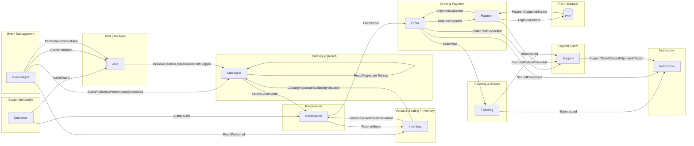
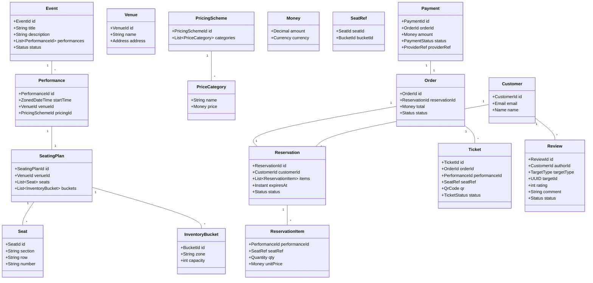
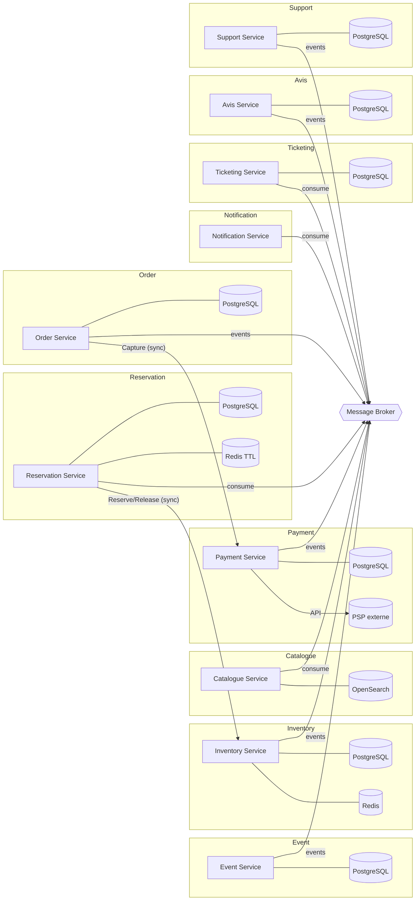
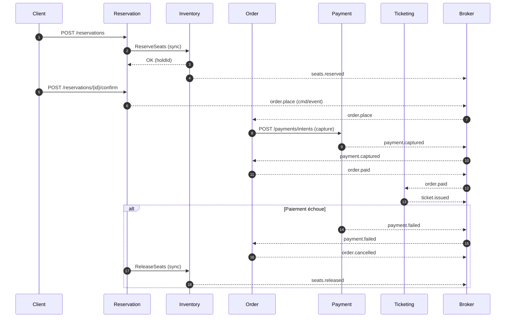
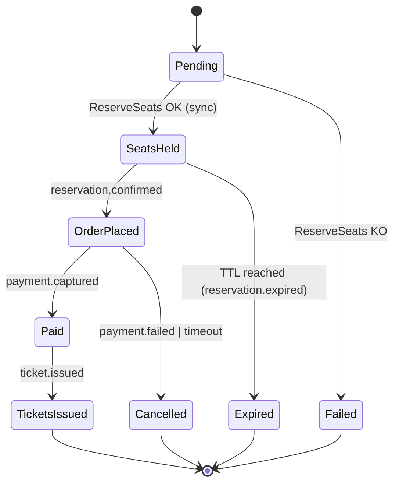
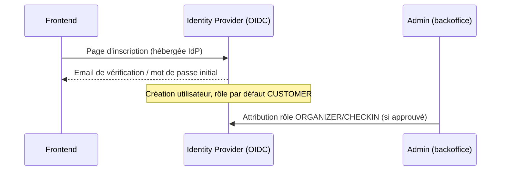
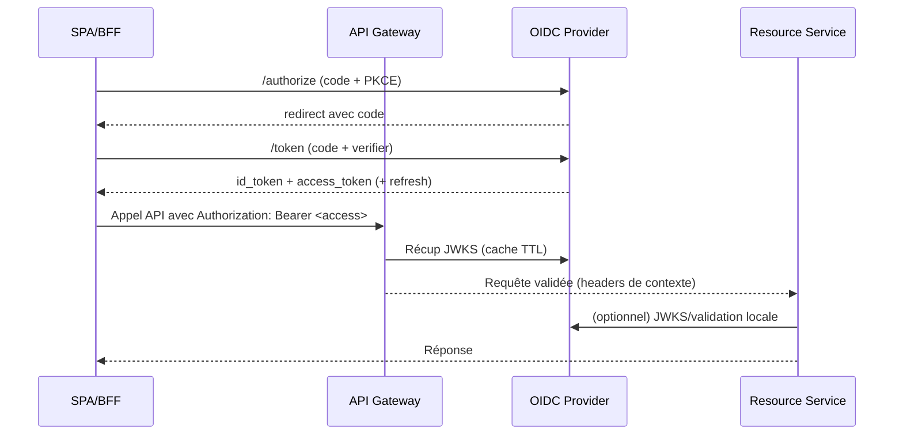
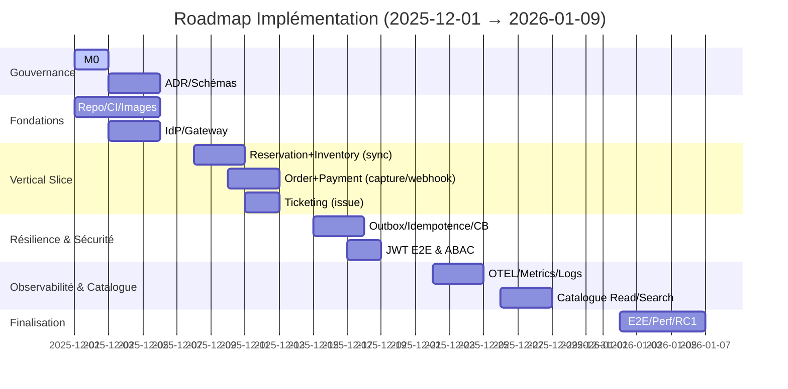
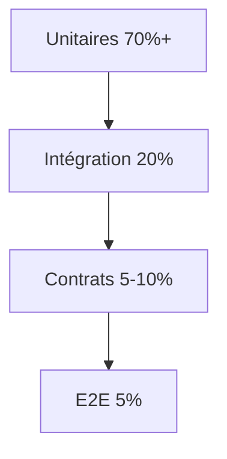

### À cause de la conversion en PDF, il y a eu des coupes dans des parties de code. Pour une lecture facilitée, nous recommandons d'utiliser le fichier HTML.
https://github.com/filfai1003/pr_microservice

# BINV3140 — Projet Microservices

Groupe 08
- Ambrozewski Kornel
- Chu Jason
- Faiella Filippo
- Longheval Louis-Nicolas

## Résumé Exécutif
- But: construire Eventify, une billetterie en microservices.
- Principes: DDD, échanges par événements, une base PostgreSQL par service, RabbitMQ, Redis (TTL), OpenSearch pour la recherche.
- Cohérence: forte pour stock, check‑in et paiement; ailleurs, Sagas + Outbox.
- Sécurité: OAuth2/OIDC; vérification des JWT à la Gateway et dans les services; rôles et scopes simples.
- Observabilité: métriques, logs JSON et traces avec `x-correlation-id`.
- Déploiement: Dev (Compose) puis Kubernetes (Staging/Prod); CI/CD avec tests et images signées.

## Analyse du Domaine & DDD (Brouillon)

### 1) Processus métier clés

- Créer un événement: Un organisateur définit titre, description, dates/séances, lieu, catégories de prix, capacités. Résultat: l’événement est en état « brouillon ».
- Configurer le plan de salle: Définir le seating plan (zones, sièges numérotés ou placement libre), les quotas, catégories tarifaires et règles (ex. accessibilité, bundles).
- Publier / Ouvrir les ventes: Passer l’événement en état « publié », ouvrir une ou plusieurs séances à la vente. Déclenche les projections côté catalogue.
- Rechercher / Consulter un événement: Un client parcourt le catalogue, filtre par date/lieu, consulte les séances, la disponibilité et les prix.
- Réserver une place: Verrouiller temporairement des sièges/quantités pour un client (panier). Délai d’expiration des réservations temporaires.
- Payer la commande: Le client règle via un prestataire de paiement. En cas de succès, la commande passe en « payée ».
- Émettre le billet: Après paiement, générer billets (QR/Barcodes), les associer aux sièges, envoyer au client.
- Annuler réservation/commande: Libérer les sièges si non payée; si payée, déclencher workflow d’annulation et remboursement selon politique.
- Rembourser: Effectuer remboursement partiel/total, publier l’événement de remboursement et rétablir disponibilité.
- Check-in / Contrôle d’accès: Scanner billets à l’entrée, valider l’authenticité et l’état (utilisé/non utilisé), enregistrer l’accès.

Principales règles transverses:
- Disponibilité en temps réel: cohérence entre réservations et stock de sièges.
- Expiration des réservations: libérer automatiquement après délai.
- Idempotence et résilience: surtout pour paiement et émission des billets.
- Traçabilité: événements de domaine persistés (audit, projections, reporting).

---

### 2) Bounded Contexts (DDD)

1. Event Management (Planification)
	 - Rôle: Créer/éditer événements, séances, tarifs, politiques d’annulation; états brouillon/publié/archivé.
	 - Agrégats: `Event`, `Performance` (séance), `PricingScheme`.
	 - Commandes: CreateEvent, UpdateEvent, PublishEvent, SchedulePerformance.
	 - Événements domaine: EventCreated, EventPublished, PerformanceScheduled, EventUpdated.

2. Venue & Seating (Inventory)
	 - Rôle: Modéliser salles/plans, sièges, quotas; contrôler le stock (sièges nominatifs ou capacity-based).
	 - Agrégats: `Venue`, `SeatingPlan`, `Seat`, `InventoryBucket` (placement libre par zone).
	 - Commandes: DefineSeatingPlan, ReserveSeats, ReleaseSeats, AdjustCapacity.
	 - Événements: SeatsReserved, SeatsReleased, CapacityAdjusted.

3. Catalogue (Lecture/Recherche)
	 - Rôle: Vue orientée lecture pour clients (events, disponibilités, prix), indexée pour recherche.
	 - Modèle: Projections/Read Models alimentés par Event Management & Inventory.
	 - Intégrations: Consomme EventPublished, PerformanceScheduled, CapacityAdjusted.

4. Reservation (Panier & Holds)
	 - Rôle: Gérer réservations temporaires, paniers, expirations; référencer sièges/quantités.
	 - Agrégats: `Reservation` (avec items), `ReservationHold`.
	 - Commandes: StartReservation, AddItem, ConfirmReservation, CancelReservation.
	 - Événements: ReservationStarted, ReservationItemAdded, ReservationExpired, ReservationCancelled.

5. Order & Payment
	 - Rôle: Transformer une réservation confirmée en commande, encaisser paiements, gérer états (en attente, payé, échoué, remboursé).
	 - Agrégats: `Order`, `Payment`.
	 - Commandes: PlaceOrder, CapturePayment, RefundPayment.
	 - Événements: OrderPlaced, PaymentCaptured, PaymentFailed, PaymentRefunded.

6. Ticketing & Access Control
	 - Rôle: Émettre billets (numériques), gérer statut (valide, annulé, utilisé), contrôler accès sur site.
	 - Agrégats: `Ticket`, `CheckIn`.
	 - Commandes: IssueTickets, RevokeTicket, CheckInTicket.
	 - Événements: TicketIssued, TicketRevoked, TicketCheckedIn.

7. Customer / Identity
	 - Rôle: Comptes clients, profils, consentements; éventuellement KYC.
	 - Agrégats: `Customer`.
	 - Événements: CustomerRegistered, CustomerUpdated.

8. Notification
	 - Rôle: Envoi d’emails/SMS (confirmation, billets, annulations, remboursements).
	 - Événements consommés: TicketIssued, OrderPlaced, PaymentRefunded, etc.

9. Avis (Notes & Commentaires)
	 - Rôle: Permettre aux clients de laisser des notes/commentaires sur des événements ou des performances; modération simple.
	 - Agrégats: `Review` (note 1–5, texte, cible: event/performance), `ReviewFlag`.
	 - Commandes: CreateReview, UpdateReview, DeleteReview, FlagReview.
	 - Événements: ReviewCreated, ReviewUpdated, ReviewDeleted, ReviewFlagged.

10. Support Client
	 - Rôle: Gérer les tickets de support (questions, problèmes) liés aux commandes, paiements, billets.
	 - Agrégats: `SupportTicket` (statut, sujet, description, liens vers order/payment/ticket), `SupportMessage`.
	 - Commandes: CreateTicket, UpdateTicket, CloseTicket, AddMessage, AssignTicket.
	 - Événements: SupportTicketCreated, SupportTicketUpdated, SupportTicketClosed, SupportMessageAdded, SupportTicketAssigned.

Relations typiques (patterns):
- Customer–Supplier: Event Management (supplier) → Catalogue (customer)
- Conformist/ACL: Reservation consomme Inventory via ACL ou API dédiée pour éviter le couplage au modèle d’Inventory.
- Anticorruption Layer: Order & Payment vers PSP (Prestataire Paiement).

---

### 3) Carte des Domaines (Context Map)



Légende relationnelle: EM→CAT (Customer–Supplier), RSV→INV (ACL/Contract), PAY↔PSP (ACL & Adapter), événements asynchrones pour la cohérence éventuelle.

---

### 4) Modèle conceptuel initial (Entités & Value Objects)



Événements de domaine (exemples):
- EventCreated, EventPublished, PerformanceScheduled
- SeatsReserved, SeatsReleased, AvailabilityUpdated
- ReservationStarted, ReservationExpired, ReservationCancelled
- OrderPlaced, PaymentCaptured, PaymentFailed, PaymentRefunded
- TicketIssued, TicketCheckedIn, TicketRevoked

---

### Décisions validées (résumé)

- Modèle d’inventaire: Sièges numérotés ET capacité par zone (hybride), activable par événement; par défaut, zones de capacité pour concerts, sièges nominatifs pour conférences.
- Réservations: TTL fixe 10 minutes (configurable), annulation utilisateur jusqu’à 24h avant la performance (remboursement selon politique), annulation organisateur → remboursement total.
- PSP: Stripe (SCA/3DS2), webhook signé (`Stripe-Signature`) exigé; intents/capture via Payment Service, fallback par webhook.
- NFR/SLA: API Gateway disponibilité ≥ 99.9% mensuelle; `POST /orders` p95 < 300 ms; `GET /catalog/**` p95 < 200 ms; latence de projection Catalogue p95 ≤ 3 s.
- Périmètre minimal: 8 services comme définis (Event, Inventory, Catalogue, Reservation, Order, Payment, Ticketing, Notification); endpoints obligatoires listés ci‑dessous.

Choix d’outillage (appliqués):
- Gateway: Envoy (vérification JWT, rate limiting, routing).
- IdP: Keycloak (OIDC/OAuth2, rôles/scopes, JWKS).
- Mode check‑in offline: non supporté par défaut; mode dégradé limité (cache local de 5 minutes max, resynchronisation obligatoire) pour éviter la fraude.
- Politique d’annulation/remboursement: 
	- Annulation client: jusqu’à 24h avant la performance, remboursement à 100%.
	- Annulation < 24h: pas de remboursement, sauf cas de force majeure (à l’appréciation de l’organisateur).
	- Événement annulé par l’organisateur: remboursement à 100%.
	- Frais: 0€ de frais pour les remboursements standards dans le périmètre du cours.

Ces choix sont appliqués dans Inventory, Reservation, Payment et les SLOs.

---

## Décomposition en Microservices

Nombre de services (proposé): 10 au total — 6 « core » (Event, Inventory, Catalogue, Reservation, Order, Ticketing) + 4 « transverses » (Payment, Notification, Avis, Support). L’identité (Customer/Auth) peut être externalisée (IdP) ou réduite à un profil léger.

Justification du découpage:
- Autonomie de données: chaque service possède ses agrégats et ses tables/index.
- Fréquence de changement: la tarification/programmation (Event) évolue différemment de la billetterie (Ticketing) et du paiement (Payment).
- Scalabilité spécifique: lecture catalogue, réservations « bursty », check-in temps réel.
- Faible couplage via événements: cohérence éventuelle acceptée pour catalogue et ticketing.

### Services, responsabilités, dépendances et stockage

1) Event Service (Event Management)
- Responsabilités: création/édition d’événements, séances, pricing; publication/archivage.
- API/Events: Commands (Create/Update/Publish), events (EventCreated, EventPublished, PerformanceScheduled).
- Dépendances: publie des événements vers le bus; pas d’appel synchrone requis côté core.
- Base de données: PostgreSQL (relationnel) — modèles fortement structurés (events/séances/prix), contraintes d’intégrité, transactions simples.

2) Inventory Service (Venue & Seating)
- Responsabilités: plans de salle, sièges, capacités, réservations de stock (sièges ou buckets).
- API/Events: ReserveSeats, ReleaseSeats; events (SeatsReserved, SeatsReleased, CapacityAdjusted).
- Dépendances: appelé de façon synchrone par Reservation pour réserver/libérer; émet des événements pour projections.
- Base de données: PostgreSQL (structure de plan/sièges) + Redis (compteurs/disponibilité/hyper-rapide) — justification: concurrence fine et TTL rapides.

3) Catalogue Service (Read/Search)
- Responsabilités: vue client pour recherche/filtrage, disponibilité agrégée, SEO-friendly.
- API/Events: queries REST/GraphQL; consomme EventPublished/CapacityAdjusted pour alimenter ses read models.
- Dépendances: uniquement asynchrones (consumer d’événements) — pas d’appel synchrone.
- Base de données: OpenSearch/Elasticsearch (indexation & recherche full-text/facettes) + cache Redis optionnel.

4) Reservation Service (Panier & Holds)
- Responsabilités: démarrer une réservation, ajouter items, gérer expiration/annulation.
- API/Events: StartReservation, AddItem, Confirm/Cancel; events (ReservationStarted, ReservationExpired, ReservationCancelled).
- Dépendances: appel synchrone à Inventory (Reserve/Release) via ACL; émet vers Order à la confirmation.
- Base de données: PostgreSQL (état des réservations) + Redis (holds/locks avec TTL) — justification: expirations fiables et rapides.

5) Order Service (Commande)
- Responsabilités: créer commandes à partir des réservations confirmées, calcul total, statut (en_attente, payé, remboursé).
- API/Events: PlaceOrder, MarkPaid/Failed; events (OrderPlaced, OrderPaid, OrderCancelled).
- Dépendances: appel synchrone au Payment Service pour initier/capturer; outbox pour fiabiliser les événements.
- Base de données: PostgreSQL — transactions, intégrité, outbox pattern pour publication d’événements.

6) Payment Service (Paiement)
- Responsabilités: intégration PSP (ex. Stripe), intents, captures, remboursements, webhooks.
- API/Events: CapturePayment, RefundPayment; events (PaymentCaptured, PaymentFailed, PaymentRefunded).
- Dépendances: externe vers PSP; callbacks webhooks → idempotence et vérification signature.
- Base de données: PostgreSQL — suivi des intents/transactions + table d’idempotence; outbox pour fiabilité.

7) Ticketing Service (Émission & Accès)
- Responsabilités: générer billets (QR/PDF), statut (valide/annulé/utilisé), check-in temps réel.
- API/Events: IssueTickets, Revoke, CheckIn; events (TicketIssued, TicketCheckedIn).
- Dépendances: consomme OrderPaid; pas d’appel synchrone critique aux autres; exposition d’un endpoint check-in faible latence.
- Base de données: PostgreSQL (billets, logs de scan) + stockage objet (PDF) + Redis optionnel pour tokens de scan rapides.

8) Notification Service (Emails/SMS)
- Responsabilités: envoi de confirmations, billets, annulations, remboursements, relances.
- API/Events: consomme TicketIssued, OrderPlaced/Paid, PaymentRefunded.
- Dépendances: broker uniquement; pas d’appels synchrones nécessaires.
- Base de données: (optionnel) PostgreSQL pour templates/outbox; sinon stateless + broker.

9) Avis Service (Notes & Commentaires)
- Responsabilités: création/édition/suppression de commentaires, attribution de notes (1–5), flags/modération.
- API/Events: Create/Update/Delete/Flag; events (ReviewCreated, ReviewUpdated, ReviewDeleted, ReviewFlagged).
- Dépendances: consomme EventPublished/PerformanceScheduled (pour référencer les cibles); publie événements vers Catalogue pour agrégations de notes.
- Base de données: PostgreSQL (tables `reviews`, `review_flags`) + outbox pour publication.

10) Support Service (Support Client)
- Responsabilités: tickets de support (création, messages, assignation, clôture), lien avec commandes/paiements/billets.
- API/Events: CreateTicket/UpdateTicket/CloseTicket/AddMessage/Assign; events (SupportTicketCreated, SupportTicketUpdated, SupportTicketClosed, SupportMessageAdded, SupportTicketAssigned).
- Dépendances: consomme `order.paid`, `payment.failed/refunded`, `ticket.issued` pour contexte; peut notifier via Notification.
- Base de données: PostgreSQL (tables `support_tickets`, `support_messages`) + outbox.

Remarque identité: Customer/Auth peut s’appuyer sur un IdP (ex. Keycloak/Auth0) — profils clients légers stockés côté service consommateur si besoin (CQRS/duplication contrôlée).

### Dépendances et communication
- Synchronous (critique): Reservation → Inventory (réservation immédiate de stock); Order → Payment (capture). Ces appels sont protégés par timeouts/retries, idempotence.
- Asynchronous (événements): Event → Catalogue/Inventory; Inventory → Catalogue/Reservation; Payment → Order; Order → Ticketing; Ticketing → Notification. Cohérence éventuelle acceptée pour lecture/émission.
- Contrats & ACL: Reservation parle à Inventory via ACL (anti-corruption) pour éviter le couplage au modèle interne d’Inventory; Payment encapsule le PSP via un adapter.
- Fiabilité: Outbox + broker (RabbitMQ) pour éviter la perte d’événements; consumers idempotents.
- Transactions: éviter les 2PC; préférer Sagas (choreography) pour flux Réservation→Commande→Paiement→Billets.

### Vue d’ensemble (services + bases de données)



### Règles « base par service » et polyglotte
- Un service = son propre schéma de données; pas de lecture croisée directe (pas de jointures inter-services).
- Polyglot persistence: chaque service choisit le stockage optimisé pour son besoin (transactions vs recherche vs TTL).
- Données en lecture: dupliquées via événements vers les read models (Catalogue) pour découplage et performance.

---

## Spécification des APIs

Cette section décrit: endpoints REST (verbe, URL, paramètres, corps), formats d’échange (DTO), événements publiés/consommés (nom + schéma), statuts HTTP et codes d’erreur.

### Conventions générales (DTO)
- Encodage: JSON UTF-8; `Content-Type: application/json`.
- Identifiants: UUID v4 en chaîne (`"550e8400-e29b-41d4-a716-446655440000"`).
- Dates/Heures: ISO 8601 en UTC (`2025-03-21T19:30:00Z`).
- Montants: objet `Money { currency: "EUR", amount: "49.90" }` (decimal string).
- Pagination: `page`, `size`; réponse inclut `page`, `size`, `total`, `items`.
- Idempotence: entêtes `Idempotency-Key` pour `POST` sensibles (paiements, commandes, réservations).
- Concurrence optimiste: `ETag` + `If-Match` sur ressources éditables.
- Corrélation: entête `X-Correlation-Id` et propagée dans événements.

### Format d’erreur (standard)
```json
{
	"error": {
		"code": "validation_error",
		"message": "Champ 'title' requis",
		"details": [
			{ "field": "title", "issue": "required" }
		],
		"correlationId": "f9c1a3f8-4f4c-4d69-a2a8-4a6e7d0d1234"
	}
}
```

### Statuts HTTP typiques
- 200 OK, 201 Created (+ `Location`), 202 Accepted (traitement asynchrone), 204 No Content
- 400 Bad Request (validation), 401 Unauthorized, 403 Forbidden, 404 Not Found
- 409 Conflict (stock indisponible/concurrence), 410 Gone (réservation expirée), 422 Unprocessable Entity (règle métier)
- 429 Too Many Requests, 500 Internal Server Error, 503 Service Unavailable

---

### Endpoints obligatoires (exigences minimales)

- Catalogue:
	- `GET /catalog/events`
	- `GET /catalog/events/{eventId}`
	- `GET /catalog/performances/{performanceId}/availability`
- Reservation:
	- `POST /reservations`
	- `POST /reservations/{reservationId}/items`
	- `POST /reservations/{reservationId}/confirm`
	- `DELETE /reservations/{reservationId}`
- Inventory:
	- `POST /inventory/holds`
	- `POST /inventory/holds/{holdId}/release`
- Order:
	- `POST /orders`
	- `GET /orders/{orderId}`
- Payment:
	- `POST /payments/intents`
	- `POST /payments/{paymentId}/capture`
	- `POST /payments/{paymentId}/refunds`
	- `POST /webhooks/psp`
- Ticketing:
	- `POST /tickets/issue`
	- `GET /tickets/{ticketId}`
	- `POST /tickets/{ticketId}/check-in`
- Notification (optionnel):
	- `POST /notifications/test`

- Avis:
	- `POST /reviews`
	- `GET /reviews?eventId={eventId}`
	- `GET /reviews?performanceId={performanceId}`
	- `PUT /reviews/{reviewId}`
	- `DELETE /reviews/{reviewId}`
	- `POST /reviews/{reviewId}/flag`

- Support:
	- `POST /support/tickets`
	- `GET /support/tickets/{ticketId}`
	- `PUT /support/tickets/{ticketId}`
	- `POST /support/tickets/{ticketId}/messages`
	- `POST /support/tickets/{ticketId}/close`


### Event Service (Event Management)

- POST `/events`
	- Body:
	```json
	{ "title": "Concert X", "description": "...", "performances": [], "pricing": { "categories": [{"name":"Standard","price":{"currency":"EUR","amount":"39.00"}}] } }
	```
	- 201 → `{ "eventId": "..." }`

- PUT `/events/{eventId}` (If-Match ETag)
- POST `/events/{eventId}/publish`
- POST `/events/{eventId}/performances`
	- Body:
	```json
	{ "startTime":"2025-06-01T19:30:00Z", "venueId":"...", "pricingId":"..." }
	```

Événements publiés (CloudEvents-like envelope):
```json
{
	"id": "uuid",
	"type": "event.created",
	"source": "event-service",
	"specversion": "1.0",
	"time": "2025-05-01T10:00:00Z",
	"correlationId": "uuid",
	"data": { "eventId": "uuid", "title": "Concert X" }
}
```
Types: `event.created`, `event.published`, `performance.scheduled`.

---

### Inventory Service (Venue & Seating)

- POST `/venues` → crée un lieu
- POST `/venues/{venueId}/seating-plans` → définit un plan
- POST `/inventory/holds`
	- Réserve des sièges/quotas avec TTL.
	- Body:
	```json
	{ "performanceId":"...", "seats":[{"seatId":"A-12"},{"seatId":"A-13"}], "ttlSeconds":300 }
	```
	- 201 → `{ "holdId":"...", "expiresAt":"2025-06-01T18:35:00Z" }`

- POST `/inventory/holds/{holdId}/release` → libère

Événements: `seats.reserved`, `seats.released`, `capacity.adjusted` avec payload:
```json
{ "performanceId":"...", "holdId":"...", "seats":["A-12","A-13"], "expiresAt":"..." }
```

---

### Catalogue Service (Read/Search)

- GET `/catalog/events?query=&from=&to=&city=&page=&size=`
	- 200 →
	```json
	{ "page":1, "size":20, "total":124, "items":[ {"eventId":"...","title":"...","nextPerformance":"2025-06-01T19:30:00Z"} ] }
	```

- GET `/catalog/events/{eventId}`
- GET `/catalog/performances/{performanceId}/availability`
	- 200 → `{ "available": true, "remaining": 42 }` (ou par zone/siège)

Consomme événements: `event.published`, `performance.scheduled`, `capacity.adjusted`.

---

### Reservation Service (Panier & Holds)

- POST `/reservations` (Idempotency-Key)
	- Body:
	```json
	{ "customerId":"...", "expiresInSeconds":300 }
	```
	- 201 → `{ "reservationId":"...", "status":"pending", "expiresAt":"..." }`

- POST `/reservations/{reservationId}/items`
	- Body:
	```json
	{ "performanceId":"...", "items":[ {"seatId":"A-12","unitPrice":{"currency":"EUR","amount":"39.00"}} ] }
	```

- POST `/reservations/{reservationId}/confirm`
	- 200 → `{ "reservationId":"...", "status":"confirmed" }` (déclenche `PlaceOrder`)

- DELETE `/reservations/{reservationId}` → annule et libère holds

Événements: `reservation.started`, `reservation.item.added`, `reservation.expired`, `reservation.cancelled`.

---

### Order Service (Commande)

- POST `/orders` (souvent interne après confirmation)
	- Body:
	```json
	{ "reservationId":"...", "amount":{"currency":"EUR","amount":"78.00"} }
	```
	- 201 → `{ "orderId":"...", "status":"pending" }`

- GET `/orders/{orderId}` → détail

Événements: `order.placed`, `order.paid`, `order.cancelled`.

---

### Payment Service (Paiement)

- POST `/payments/intents` (Idempotency-Key)
	- Body:
	```json
	{ "orderId":"...", "amount":{"currency":"EUR","amount":"78.00"}, "method":"card" }
	```
	- 201 → `{ "paymentId":"...", "clientSecret":"...", "status":"requires_action" }`

- POST `/payments/{paymentId}/capture`
- POST `/payments/{paymentId}/refunds`
- POST `/webhooks/psp` (callback PSP) — vérification de signature

Événements: `payment.captured`, `payment.failed`, `payment.refunded`.

---

### Ticketing Service (Émission & Accès)

- POST `/tickets/issue`
	- Body:
	```json
	{ "orderId":"..." }
	```
	- 201 → `{ "tickets":[{"ticketId":"...","qr":"data:..."}] }`

- GET `/tickets/{ticketId}`
- POST `/tickets/{ticketId}/check-in`
	- 200 → `{ "status":"checked_in", "at":"2025-06-01T19:05:00Z" }`

Événements: `ticket.issued`, `ticket.checked_in`, `ticket.revoked`.

---

### Notification Service

- Principalement event-driven; optionnel:
	- POST `/notifications/test` (diagnostic)
	- GET `/templates`

Consomme: `ticket.issued`, `order.paid`, `payment.refunded`.

---

### Avis Service (Reviews)

- POST `/reviews`
	- Body:
	```json
	{ "targetType": "event", "targetId": "uuid", "rating": 5, "comment": "Très bon concert" }
	```
	- 201 → `{ "reviewId": "..." }`

- GET `/reviews`
	- Query: `eventId` ou `performanceId`
	- 200 → `[{ "reviewId":"...", "authorId":"...", "rating":4, "comment":"..." }]`

- PUT `/reviews/{reviewId}`
	- Body: `{ "rating": 4, "comment": "mise à jour" }`
	- 200 → review mise à jour

- DELETE `/reviews/{reviewId}`
	- 204

- POST `/reviews/{reviewId}/flag`
	- Body: `{ "reason": "spam" }`
	- 202 → flag enregistré

Événements publiés:
```json
{ "type": "review.created", "source": "avis-service", "data": { "reviewId": "uuid", "targetType":"event", "targetId":"uuid", "rating":5 } }
{ "type": "review.updated", "source": "avis-service", "data": { "reviewId": "uuid", "rating":4 } }
{ "type": "review.deleted", "source": "avis-service", "data": { "reviewId": "uuid" } }
{ "type": "review.flagged", "source": "avis-service", "data": { "reviewId": "uuid", "reason":"spam" } }
```

Consommateurs:
- Catalogue: agrège moyenne et nombre de reviews par `eventId`/`performanceId` pour la lecture.
- Notification (optionnel): peut notifier l’organisateur en cas de `review.flagged`.

---

### Schéma d’enveloppe d’événement (CloudEvents-like)
```json
{
	"type": "string (ex: payment.captured)",
	"id": "uuid",
	"source": "service-name",
	"specversion": "1.0",
	"time": "ISO-8601",
	"correlationId": "uuid",
	"data": {}
}
```

Exemples de payloads `data`:
- `payment.captured`:
```json
{ "paymentId":"...", "orderId":"...", "amount":{"currency":"EUR","amount":"78.00"} }
```
- `seats.reserved`:
```json
{ "performanceId":"...", "holdId":"...", "seats":["A-12","A-13"], "expiresAt":"..." }
```

---

## Stratégie de Cohérence

Objectif: déterminer où la cohérence forte est requise et où une cohérence éventuelle est acceptable, puis définir une Saga de réservation (étapes, messages, compensations).

### Cohérence forte (requise)
- Inventory (réservation de sièges/capacité): l’allocation d’un siège ou décrément d’un quota doit être atomique et sérialisée au niveau du service Inventory.
	- Technique: transaction DB avec verrouillage ligne/unique constraint (clé unique `(performanceId, seatId, holdActive=true)`), ou compteur atomique sur bucket; éventuellement Redis pour vitesse mais PostgreSQL reste source de vérité.
	- API synchrone: Reservation appelle Inventory et attend succès/échec immédiat pour décider.
- Ticketing (check-in): la transition d’état d’un billet (valid → used) doit être atomique pour éviter la double entrée.
	- Technique: transaction locale + contrainte d’unicité sur `(ticketId, used=false)`; cache permissif possible mais validation finale en DB.
- Payment (capture/remboursement): cohérence forte à l’intérieur du service (statut du payment), idempotence stricte côté webhooks/capture.

### Cohérence éventuelle (acceptable)
- Catalogue (read/search): projections alimentées par événements; latence acceptable (SLO p95 ≤ 3s) entre publication et visibilité.
- Notifications: envoi best-effort avec retries; pas de transaction métier dépendante de l’envoi.
- Synchronisation des profils clients et vues d’agrégats: copies CQRS locales, mises à jour asynchrones.
- Libération d’un hold par expiration: déclenchée par TTL/cron; libération visible avec légère latence.

### Principes
- Pas de 2PC: préférer Sagas et Outbox pattern pour la publication d’événements.
- Idempotence: clés d’idempotence pour `POST` critiques (réservations, paiements), dédupe côté consommateurs.
- At-least-once: consommateurs idempotents; événements versionnés.
- Timeouts/Retry: appels sync avec `timeout` + `retry` exponentiel et circuit breaker.

---

### Saga de Réservation (Choreography)

Narratif (succès):
1) Client démarre une réservation (ReservationStarted).
2) Reservation envoie `ReserveSeats` (sync) → Inventory; Inventory répond OK et publie `seats.reserved`.
3) Client confirme la réservation → Reservation publie `order.place` (ou appelle Order API).
4) Order crée la commande et demande un paiement → Payment crée l’intent/capture; à succès publie `payment.captured`.
5) Order reçoit `payment.captured` → passe `order.paid` et publie l’événement.
6) Ticketing consomme `order.paid` → émet les billets (`ticket.issued`). Saga terminée.

Compensations (échecs):
- Échec `ReserveSeats`: Reservation publie `reservation.cancelled` (raison: out_of_stock).
- Expiration réservation: TTL déclenche `reservation.expired` → Reservation appelle Inventory `ReleaseSeats`.
- Échec paiement (timeout/failed): Payment publie `payment.failed` → Order passe `order.cancelled` → Reservation appelle Inventory `ReleaseSeats`.
- Échec d’émission billets: Ticketing publie `ticket.issue.failed`; Order peut tenter `refund` ou marquer `order.cancelled` et notifier support; si des billets ont été partiellement émis, `ticket.revoked` + `payment.refunded`.

Orchestration alternative:
- Orchestrateur = Order Service (ou Reservation). Avantage: visibilité centralisée, inconvénient: couplage accru. Pour ce projet, preferer choreography afin de limiter le couplage.

### Diagramme de séquence (succès + échec paiement)



### Contrôles d’intégrité et patterns
- Unicité sièges: contrainte unique `(performanceId, seatId, holdActive)` + TTL/expiration.
- Outbox: tables outbox par service (Order, Payment, Ticketing) avec publisher fiable.
- Idempotency store: table dédiée (Payment/Order) indexée par `Idempotency-Key`.
- Dead-letter queues: pour événements non consommables; alerting pour intervention.
- Observabilité: logs corrélés (`X-Correlation-Id`), métriques latence/erreurs, traces distribuées.

---

## Conception de la Sécurité

Note: Voir aussi « Conception de la Sécurité — Détails Auth & Rôles » pour exemples et configurations.

But: définir l’authentification, les rôles et comment on vérifie/autorise côté services.

### Méthode d’authentification
- Protocole: OpenID Connect (OIDC) et OAuth2 via un IdP (Keycloak/Auth0).
- Flots:
	- Frontend: Authorization Code + PKCE (SPA ou BFF) → tokens courts + refresh.
	- Service-to-service: Client Credentials avec audience ciblée.
	- App Check-in: Authorization Code + PKCE, tokens très courts; mTLS possible en interne.
- Jetons: JWT signés avec `iss`, `aud`, `exp`, `sub`, `scope`, `roles`.
- Stockage tokens: en mémoire (ou BFF avec cookie httpOnly même‑site).

Exemple d’extraits de claims:
```json
{
	"iss": "https://idp.example.com/",
	"aud": "reservation-service",
	"sub": "c6f6c1a5-...", 
	"scope": "catalog:read reservation:write order:write",
	"realm_access": { "roles": ["CUSTOMER"] },
	"resource_access": {
		"event-service": { "roles": ["ORGANIZER"] },
		"ticketing-service": { "roles": ["CHECKIN"] }
	}
}
```

### Rôles et permissions (RBAC + règles métier)
- Rôles principaux:
	- `CUSTOMER`: parcourir le catalogue, créer/valider une réservation, payer, consulter ses billets.
	- `ORGANIZER`: créer/éditer/publier événements et séances, configurer plans/prix, consulter ventes de ses événements.
	- `CHECKIN`: contrôler l’accès (scan), voir les billets d’un événement assigné.
	- `ADMIN`: gestion globale (venues, utilisateurs, audit), opérations sensibles.

Matrice (extraits):
- Event Service: `ORGANIZER` (owner) → CRUD sur ses `Event`/`Performance`; `ADMIN` → global. Vérifier ownership (`event.ownerId == sub`) côté service.
- Inventory: `ORGANIZER`/`ADMIN` → plans de salle pour leurs événements; `Reservation` (service account) → réserver/libérer (scope `inventory:hold`).
- Catalogue: `ANONYMOUS`/`CUSTOMER` → lecture publique.
- Reservation: `CUSTOMER` → CRUD de sa réservation (`reservation.customerId == sub`).
- Order/Payment: `CUSTOMER` → commandes/paiements propres; `ADMIN` → remboursement.
- Ticketing: `CHECKIN` → check-in; `CUSTOMER` → lecture de ses billets.
- Notification: interne (event-driven); endpoints, si exposés, limités à `ADMIN`.
- Avis: `CUSTOMER` → créer/modifier/supprimer ses propres reviews; `ADMIN`/`ORGANIZER` → modération (flag/suppression) sur événements dont ils sont propriétaires.
- Support: `CUSTOMER` → créer/lire ses tickets; `ADMIN`/support → assigner et clôturer; lecture des liens (order/payment/ticket) via scopes dédiés.

Règles d’autorisation supplémentaires (ABAC):
- Ownership: vérifier que `sub` du token correspond au propriétaire de la ressource (event, reservation, order) au moment de l’action.
- Scopes: `catalog:read`, `reservation:write`, `inventory:hold`, `order:write`, `payment:capture`, `ticket:checkin`, `reviews.write`, `reviews.moderate`, `support.write`, `support.manage` contrôlés à la passerelle et au service.

### Vérification côté services (Resource Servers)
- Validation JWT: vérifier `iss`, `aud`, `exp/nbf`, `kid` via JWKS (cache + rotation), horloge tolérance 60s.
- Contrôle du scope/role: mapping endpoint → scopes/roles requis; refuser 403 si insuffisant.
- Multi-défense: vérification à l’API Gateway (OPA/Keycloak authz) et dans chaque service.
- Logs d’audit: tracer `sub`, `roles`, `scope`, `correlationId` par action sensible.

### Service-to-service & webhooks
- Inter-services: Client Credentials; chaque service a un client IdP dédié et des scopes stricts (p. ex. `reservation-service` → `inventory:hold`).
- mTLS optionnel entre services internes pour renforcer l’authenticité côté réseau.
- Webhooks PSP: ne pas utiliser Bearer; vérifier signature HMAC du PSP et l’horodatage; rejeter replays (fenêtre courte, nonce).

Exemple d’en-têtes webhook:
```
Stripe-Signature: t=1699970000,v1=abc...,v1=def...
```

### Sécurité Check-in
- Appareil `CHECKIN`: tokens très courts (5–15 min), rafraîchissement contrôlé, scope `ticket:checkin` limité à événements assignés.
- Validation scan: la vérification finale se fait côté Ticketing DB (source de vérité) pour éviter les fraudes.
- Mode offline: non supporté par défaut. Si imposé, activer un mode dégradé avec cache local (5 min max) et resynchronisation obligatoire.

### Protection applicative
- CSRF: éviter les cookies non same-site; BFF pattern recommandé si nécessaire.
- CORS: restreindre `origin` aux domaines approuvés; seulement `GET,POST,PUT,DELETE` requis.
- Rate limiting & WAF: au niveau gateway; règles spécifiques pour `payments/*` et `inventory/holds`.
- Secret management: variables de secrets via vault (KMS/KeyVault), rotation régulière.
- PII minimale: ne pas stocker les données cartes; uniquement `providerRef`/tokens PSP.

---

## Plan de Déploiement & CI/CD

### Environnements
- Dev (local): Docker Compose multi-services, hot-reload, DB locales, broker local. IdP local (Keycloak) ou mocks.
- Test/Staging: Kubernetes (namespace dédié), DB managées de test, secrets via SealedSecrets/Vault, review apps par PR.
- Prod: Kubernetes HA, autoscaling (HPA), DB managées (PostgreSQL), broker managé, observabilité (logs/metrics/tracing), sauvegardes & restauration.

SLOs indicatifs:
- Catalogue p95 < 300 ms; Saga réservation end-to-end p95 < 5 s.
- Disponibilité 99.5% (cours) / 99.9% (si requis), RPO ≤ 15 min, RTO ≤ 30 min.

### Stratégie de branchement
- Recommandé: Trunk-Based Development
	- Branches courtes `feature/*`, PRs petites; `main` toujours déployable.
	- Tags SemVer (ex: `v1.2.0`). Feature flags pour activer progressivement.
- Alternative (si imposé): Git Flow simplifié (`main`, `develop`, `release/*`, `hotfix/*`).

### Versionning & images
- Tags d’image: `<service>:<semver>-<shortsha>` et `<service>:sha-<shortsha>`; éviter `latest` en prod.
- Signature & SBOM: Cosign + Syft (attestations SLSA niveau de base).
- Registry: GHCR ou Docker Hub privé.

### Pipeline CI/CD (première version)

Étapes communes:
- Qualité: lint + tests unitaires + couverture (par service).
- Build images: Docker Buildx, labels OCI, SBOM, push registry.
- Sécurité: Trivy (images) + SAST (selon stack) + vérification licences.
- Déploiement:
	- Dev: `docker compose -f compose.dev.yaml up -d` (local) ou K8s Dev.
	- Staging/Prod: Helm/Kustomize avec `values.{env}.yaml`, rolling update, health checks.

#### Exemple GitHub Actions (extrait)
```yaml
name: ci
on:
	push:
		branches: [ main ]
	pull_request:
		branches: [ main ]

jobs:
	test:
		runs-on: ubuntu-latest
		strategy:
			matrix:
				service: [ event, inventory, catalogue, reservation, order, payment, ticketing, notification ]
		steps:
			- uses: actions/checkout@v4
			- name: Run unit tests (placeholder)
				run: echo "Run tests for ${{ matrix.service }}"

	docker:
		runs-on: ubuntu-latest
		needs: test
		permissions: { contents: read, packages: write, id-token: write }
		steps:
			- uses: actions/checkout@v4
			- uses: docker/setup-buildx-action@v3
			- uses: docker/login-action@v3
				with:
					registry: ghcr.io
					username: ${{ github.actor }}
					password: ${{ secrets.GITHUB_TOKEN }}
			- name: Build & Push images
				run: |
					for SVC in event inventory catalogue reservation order payment ticketing notification; do 
						docker build -t ghcr.io/${{ github.repository }}-$SVC:${{ github.sha }} ./services/$SVC
						docker push ghcr.io/${{ github.repository }}-$SVC:${{ github.sha }}
					done

	deploy-staging:
		runs-on: ubuntu-latest
		needs: docker
		environment: staging
		if: github.ref == 'refs/heads/main'
		steps:
			- uses: actions/checkout@v4
			- uses: azure/setup-kubectl@v4
			- uses: azure/setup-helm@v4
			- name: Helm upgrade
				run: |
					helm upgrade --install micro charts/micro \
						--namespace micro-staging --create-namespace \
						--set image.tag=${{ github.sha }}
```

#### Exemple GitLab CI (extrait)
```yaml
stages: [ test, build, scan, deploy ]

unit:test:
	stage: test
	script:
		- echo "run tests per service"

docker:build:
	stage: build
	script:
		- docker buildx build --push -t $CI_REGISTRY_IMAGE/event:$CI_COMMIT_SHA services/event

deploy:staging:
	stage: deploy
	when: on_success
	script:
		- helm upgrade --install micro charts/micro --namespace micro-staging --set image.tag=$CI_COMMIT_SHA
```

### Déploiement local (Compose) — squelette
```yaml
version: '3.9'
services:
	event:
		build: ./services/event
		environment:
			- DATABASE_URL=postgres://event:pass@db:5432/event
		depends_on: [ db, broker ]
	inventory:
		build: ./services/inventory
		depends_on: [ db, redis, broker ]
	catalogue:
		build: ./services/catalogue
		depends_on: [ broker ]
	reservation:
		build: ./services/reservation
		depends_on: [ db, redis, broker ]
	order:
		build: ./services/order
		depends_on: [ db, broker ]
	payment:
		build: ./services/payment
		depends_on: [ db, broker ]
	ticketing:
		build: ./services/ticketing
		depends_on: [ db, broker ]
	notification:
		build: ./services/notification
		depends_on: [ broker ]
	db:
		image: postgres:16
		environment:
			- POSTGRES_PASSWORD=postgres
		ports: [ "5432:5432" ]
	redis:
		image: redis:7
		ports: [ "6379:6379" ]
	broker:
		image: rabbitmq:3-management
		ports: [ "5672:5672", "15672:15672" ]
```

### Déploiement K8s (Helm) — valeurs clés
- `replicaCount` (≥2 en prod), `resources` (requests/limits), `liveness/readiness` probes.
- `envFrom` secrets, `configMap` pour config non sensible.
- `hpa` activé (CPU/mémoire/QPS); `podDisruptionBudget`.
- Ingress avec TLS; rate limiting sur l’API Gateway.

### Promotion & releases
- Promotion par tag `vX.Y.Z`: build images taguées + déploiement prod.
- Rollback: `helm rollback` + stratégie DB (migrations backwards-compatibles, blue-green pour changements cassants).
- Changelog automatisé depuis PRs/commits.

### Plan détaillé — Environnements, Conteneurisation & Configuration

#### Environnements (dev / staging / prod)
- Dev (local):
	- Docker Compose avec profils (`compose.dev.yaml`), IdP/Broker/DB locaux.
	- Gateway: Envoy (JWT filter, rate limiting simple).
	- Hot reload (montage volumes) et semence de données (scripts `seed:*`).
	- Fichiers `.env.dev` par service pour variables non sensibles.
	- Commandes utiles:
		```powershell
		docker compose -f compose.dev.yaml up -d
		docker compose -f compose.dev.yaml logs -f orders
		```
- Staging:
	- Kubernetes namespace dédié (`micro-staging`), DB managées de test, secrets chiffrés (SealedSecrets/Vault).
	- Gateway: Envoy en Ingress (JWT, rate limiting).
	- Déploiements automatiques sur `main` avec tests E2E, contrats, smoke tests.
	- DNS `*.staging.example.com`, certificats TLS (Let’s Encrypt/ACME), rate limiting.
- Production:
	- Cluster K8s HA (multi-AZ), HPA + PDB, sauvegardes DB, politiques de restauration testées.
	- Gateway: Envoy (JWT, rate limiting, WAF léger si requis).
	- Déploiement progressif (canary/blue-green), approbation manuelle, fenêtres de maintenance.
	- Surveillance SLO + alertes, runbooks d’incident, drill de rollback.

#### Conteneurisation (Docker)
- Principes:
	- Images minimales, multi-stage, non-root (`USER 10001`), base images taguées (sha digest si possible).
	- Cache Docker optimisé (ordre des `COPY`), `.dockerignore` exhaustif, healthcheck.
	- Variables via env, pas de secrets dans l’image.
- Exemple Dockerfile (Node.js)
	```dockerfile
	# build
	FROM node:20-alpine AS build
	WORKDIR /app
	COPY package*.json ./
	RUN npm ci --omit=dev=false
	COPY . .
	RUN npm run build

	# runtime
	FROM gcr.io/distroless/nodejs20-debian12
	WORKDIR /app
	ENV NODE_ENV=production
	COPY --from=build /app/node_modules ./node_modules
	COPY --from=build /app/dist ./dist
	USER 10001
	EXPOSE 8080
	CMD ["/app/dist/main.js"]
	```
- Exemple Dockerfile (Spring Boot)
	```dockerfile
	FROM maven:3.9-eclipse-temurin-21 AS build
	WORKDIR /src
	COPY pom.xml .
	RUN mvn -q -e -B -DskipTests package || true
	COPY . .
	RUN mvn -q -e -B -DskipTests package

	FROM eclipse-temurin:21-jre-alpine
	ENV JAVA_OPTS="-XX:+UseG1GC -XX:MaxRAMPercentage=75"
	WORKDIR /app
	COPY --from=build /src/target/*.jar app.jar
	USER 10001
	EXPOSE 8080
	ENTRYPOINT ["sh","-c","java $JAVA_OPTS -jar app.jar"]
	```

#### Kubernetes (manifests & Helm)
- Bonnes pratiques Pods:
	- `resources` (requests/limits), `liveness`/`readiness`, `startupProbe` pour JVM.
	- `securityContext` (non-root, fsGroup), `podDisruptionBudget`, `topologySpreadConstraints`.
	- `terminationGracePeriodSeconds` + `preStop` pour drainage.
- Réseau/sécurité:
	- `NetworkPolicy` par namespace, Ingress TLS uniquement, secrets `Opaque`/`kubernetes.io/tls`.
	- ImagePolicy (admission) + signatures (Cosign), Gatekeeper/OPA pour règles.
- Exemple Deployment (extrait):
	```yaml
	apiVersion: apps/v1
	kind: Deployment
	metadata:
		name: order
		labels: { app: order }
	spec:
		replicas: 2
		strategy: { type: RollingUpdate }
		selector: { matchLabels: { app: order } }
		template:
			metadata:
				labels: { app: order }
			spec:
				serviceAccountName: order-sa
				containers:
				- name: order
					image: ghcr.io/org/repo-order:sha-<shortsha>
					ports: [ { containerPort: 8080 } ]
					envFrom: [ { configMapRef: { name: order-config } }, { secretRef: { name: order-secrets } } ]
					resources: { requests: { cpu: "200m", memory: "256Mi" }, limits: { cpu: "1", memory: "512Mi" } }
					readinessProbe: { httpGet: { path: /health/ready, port: 8080 }, initialDelaySeconds: 5, periodSeconds: 5 }
					livenessProbe:  { httpGet: { path: /health/live,  port: 8080 }, initialDelaySeconds: 15, periodSeconds: 10 }
	```

#### Configuration externalisée (12-Factor)
- Hiérarchie: env vars > Secrets/ConfigMaps > defaults.
- ConfigMaps pour non-sensible, Secrets pour credentials/keys (chiffrés au repos via KMS/CSI).
- `.env.*` seulement en dev local; jamais commiter secrets.
- Exemple ConfigMap/Secret:
	```yaml
	apiVersion: v1
	kind: ConfigMap
	metadata: { name: order-config }
	data:
		APP_ENV: staging
		CATALOG_URL: https://catalogue.staging.example.com
	---
	apiVersion: v1
	kind: Secret
	metadata: { name: order-secrets }
	type: Opaque
	stringData:
		DATABASE_URL: postgres://order:***@db:5432/order
		OIDC_JWKS_URI: https://idp.example.com/.well-known/jwks.json
	```

#### Helm / Kustomize
- Structure recommandée: chart par service + umbrella chart pour l’ensemble.
- Valeurs par environnement:
	- `values.dev.yaml` (répliques 1, logs verbeux), `values.staging.yaml` (répliques 2, probes strictes), `values.prod.yaml` (répliques 3+, HPA activé).
- Exemple valeurs (extrait):
	```yaml
	image:
		repository: ghcr.io/org/repo-order
		tag: sha-{{ .Values.gitSha }}
	resources:
		requests: { cpu: 200m, memory: 256Mi }
		limits:   { cpu: "1",  memory: 512Mi }
	ingress:
		enabled: true
		host: order.staging.example.com
		tls: true
	env:
		- name: CATALOG_URL
			value: https://catalogue.staging.example.com
	```

#### Pipeline CI/CD (détaillé)
- Étapes et gates:
	1) Lint/Type-check/Unit Tests (fail-fast)
	2) Build images + SBOM (Syft) + signature (Cosign)
	3) Scans SAST/Container (Trivy/CodeQL) — gate
	4) Contrats (Pact) Provider/Consumer — gate
	5) Integration tests (Testcontainers) — gate
	6) Deploy Staging (Helm) + Smoke tests + E2E — gate
	7) Approve → Prod (manual) → Canary 10% → 50% → 100% + rollback auto si SLO violés
	8) Post-deploy checks: migrations ok, DLQ vide, erreurs < seuil
- Commandes de base:
	```powershell
	helm upgrade --install micro charts/micro --namespace micro-staging --create-namespace `
		-f charts/micro/values.staging.yaml --set image.tag=$env:GITHUB_SHA

	helm upgrade --install micro charts/micro --namespace micro-prod `
		-f charts/micro/values.prod.yaml --set image.tag=$env:GITHUB_SHA
	```

#### Migrations base de données
- Outil: Flyway/Liquibase par service; exécution en `initContainer` ou Job pré-déploiement.
- Règles: migrations backward-compatibles, feature toggles pour accès code, rollback scripts si possible.

#### Progressive Delivery & GitOps (optionnel)
- Canary/Blue-Green via ServiceMesh (Istio/Linkerd) ou ingress canary annotations.
- GitOps: Argo CD/Flux gère sync des manifests; PR → merge → Argo déploie, drift detection et rollback.

---

## Modélisation des Événements

Toutes les publications respectent l’enveloppe CloudEvents décrite plus haut (`type`, `id`, `source`, `time`, `correlationId`, `data`). Ci-dessous, la liste des événements asynchrones avec payload `data`, producteur et consommateurs.

### Liste des événements (par domaine)

1) Event Service
- `event.created`
	- Producteur: Event Service; Consommateurs: Catalogue, Inventory
	- `data`:
	```json
	{ "eventId":"uuid", "title":"string", "ownerId":"uuid" }
	```
- `event.published`
	- Producteur: Event Service; Consommateurs: Catalogue, Inventory
	- `data`:
	```json
	{ "eventId":"uuid", "publishedAt":"ISO-8601" }
	```
- `performance.scheduled`
	- Producteur: Event Service; Consommateurs: Catalogue, Inventory, Reservation
	- `data`:
	```json
	{ "performanceId":"uuid", "eventId":"uuid", "startTime":"ISO-8601", "venueId":"uuid", "pricingSchemeId":"uuid" }
	```

2) Inventory Service
- `capacity.adjusted`
	- Producteur: Inventory; Consommateurs: Catalogue
	- `data`:
	```json
	{ "performanceId":"uuid", "bucketId":"uuid", "remaining":123 }
	```
- `seats.reserved`
	- Producteur: Inventory; Consommateurs: Reservation (pour projection/monitoring), Catalogue (optionnel)
	- `data`:
	```json
	{ "performanceId":"uuid", "holdId":"uuid", "seats":["A-12","A-13"], "buckets":[{"bucketId":"uuid","qty":2}], "expiresAt":"ISO-8601" }
	```
- `seats.released`
	- Producteur: Inventory; Consommateurs: Reservation, Catalogue
	- `data`:
	```json
	{ "performanceId":"uuid", "holdId":"uuid", "seats":["A-12"], "buckets":[{"bucketId":"uuid","qty":1}] }
	```

3) Reservation Service
- `reservation.started`
	- Producteur: Reservation; Consommateurs: Analytics/Monitoring (optionnel)
	- `data`:
	```json
	{ "reservationId":"uuid", "customerId":"uuid", "expiresAt":"ISO-8601" }
	```
- `reservation.item.added`
	- Producteur: Reservation; Consommateurs: Analytics (optionnel)
	- `data`:
	```json
	{ "reservationId":"uuid", "performanceId":"uuid", "seatId":"uuid", "bucketId":"uuid", "qty":1, "unitPrice":{"currency":"EUR","amount":"39.00"} }
	```
- `reservation.confirmed`
	- Producteur: Reservation; Consommateurs: Order
	- `data`:
	```json
	{ "reservationId":"uuid", "customerId":"uuid", "amount":{"currency":"EUR","amount":"78.00"} }
	```
- `reservation.expired` | `reservation.cancelled`
	- Producteur: Reservation; Consommateurs: Inventory (pour libération si nécessaire), Catalogue (optionnel)
	- `data`:
	```json
	{ "reservationId":"uuid", "reason":"expired|user_cancelled|payment_failed" }
	```

4) Order Service
- `order.placed`
	- Producteur: Order; Consommateurs: Payment, Notification (optionnel)
	- `data`:
	```json
	{ "orderId":"uuid", "reservationId":"uuid", "customerId":"uuid", "amount":{"currency":"EUR","amount":"78.00"} }
	```
- `order.paid`
	- Producteur: Order; Consommateurs: Ticketing, Notification
	- `data`:
	```json
	{ "orderId":"uuid", "paidAt":"ISO-8601" }
	```
- `order.cancelled` | `order.refunded`
	- Producteur: Order; Consommateurs: Notification, Catalogue (optionnel)
	- `data`:
	```json
	{ "orderId":"uuid", "reason":"payment_failed|user_request|event_cancelled" }
	```

5) Payment Service
- `payment.captured`
	- Producteur: Payment; Consommateurs: Order, Notification
	- `data`:
	```json
	{ "paymentId":"uuid", "orderId":"uuid", "amount":{"currency":"EUR","amount":"78.00"} }
	```
- `payment.failed`
	- Producteur: Payment; Consommateurs: Order
	- `data`:
	```json
	{ "paymentId":"uuid", "orderId":"uuid", "failureReason":"insufficient_funds|declined|timeout" }
	```
- `payment.refunded`
	- Producteur: Payment; Consommateurs: Order (pour marquer remboursé), Notification
	- `data`:
	```json
	{ "paymentId":"uuid", "orderId":"uuid", "amount":{"currency":"EUR","amount":"20.00"} }
	```

6) Ticketing Service
- `ticket.issued`
	- Producteur: Ticketing; Consommateurs: Notification
	- `data`:
	```json
	{ "orderId":"uuid", "tickets":[{"ticketId":"uuid","performanceId":"uuid","seatId":"uuid"}] }
	```
- `ticket.checked_in`
	- Producteur: Ticketing; Consommateurs: Analytics/Monitoring (optionnel)
	- `data`:
	```json
	{ "ticketId":"uuid", "checkedInAt":"ISO-8601", "deviceId":"string" }
	```
- `ticket.revoked`
	- Producteur: Ticketing; Consommateurs: Notification
	- `data`:
	```json
	{ "ticketId":"uuid", "reason":"refund|fraud|event_cancelled" }
	```

---

### Topologie Broker (RabbitMQ)

- Exchange principal: `domain.events` (type `topic`, durable: true)
- Routing keys: `<service>.<entity>.<event>` (ex: `event.performance.scheduled`, `inventory.seats.reserved`)

Queues et bindings (exemples):
- `catalogue.q`
	- Bindings: `event.*.*`, `inventory.capacity.adjusted`, `inventory.seats.*`
- `order.q`
	- Bindings: `reservation.confirmed`, `payment.captured`, `payment.failed`, `payment.refunded`
- `ticketing.q`
	- Bindings: `order.paid`
- `notification.q`
	- Bindings: `ticket.issued`, `order.paid`, `payment.refunded`, `order.refunded`
- `reservation.q` (optionnel pour projections internes)
	- Bindings: `inventory.seats.*`

Déclaration (extrait YAML):
```yaml
exchanges:
	- name: domain.events
		type: topic
		durable: true
queues:
	- name: catalogue.q
		durable: true
		bindings:
			- exchange: domain.events
				routing_key: 'event.*.*'
			- exchange: domain.events
				routing_key: 'inventory.capacity.adjusted'
	- name: order.q
		durable: true
		bindings:
			- exchange: domain.events
				routing_key: 'reservation.confirmed'
			- exchange: domain.events
				routing_key: 'payment.*'
```

### Idempotence, retries et DLQ

- Outbox producteur: chaque service persiste l’événement avec l’agrégat, puis un publisher fiable poste sur `domain.events`. `id` unique (UUID) par événement.
- Idempotence consommateur: table `processed_events` par service pour dédupliquer.
```sql
create table processed_events (
	event_id uuid primary key,
	source text not null,
	received_at timestamptz not null default now()
);
```
- At-least-once: les consommateurs valident (ack) uniquement après traitement + insertion `processed_events` atomique.
- Retries: pour chaque queue `*.q`, créer une `*.retry.q` (TTL 30s/2min) avec `x-dead-letter-exchange: domain.events` et redirection vers la queue d’origine via une clé de retry (ou via un exchange dédié).
- DLQ: `*.dlq` par queue avec `x-dead-letter-exchange` configuré; messages échoués N fois (ex: 5) vont en DLQ pour inspection.

Déclaration (extrait RabbitMQ):
```yaml
queues:
	- name: order.q
		durable: true
		arguments:
			x-dead-letter-exchange: domain.dlx
			x-dead-letter-routing-key: order.retry
	- name: order.retry.q
		durable: true
		arguments:
			x-message-ttl: 30000
			x-dead-letter-exchange: domain.events
			x-dead-letter-routing-key: order
	- name: order.dlq
		durable: true
bindings:
	- exchange: domain.events
		queue: order.q
		routing_key: 'reservation.confirmed'
	- exchange: domain.dlx
		queue: order.retry.q
		routing_key: 'order.retry'
```

### Gouvernance des schémas
- Versionner les schémas `data` (champ `schemaVersion` facultatif) et documenter les changements compatibles.
- Valider les payloads via JSON Schema à l’émission et à la consommation (logs + rejet vers DLQ en cas d’incompatibilité).

---

## Conception des Sagas & Circuit Breakers

Cette section détaille précisément les sagas (états, messages, compensations) et les points d’application des Circuit Breakers avec seuils.

### Saga 1 — Réservation → Commande → Paiement → Billets

State machine (vue simplifiée):


Déroulé précis (avec compensations):
1) StartReservation (Reservation)
	- Transaction locale: créer `Reservation(pending)` avec `expiresAt`.
	- Message: `reservation.started` (optionnel analytics).
	- Timeout: n/a.
	- Compensation: n/a.
2) AddItem → ReserveSeats (sync) (Reservation → Inventory)
	- Transaction locale Inventory: allouer sièges / décrémenter bucket; créer `holdId` (TTL).
	- Réponse: OK → `SeatsHeld`; KO → `Failed` (OutOfStock).
	- Compensation: si KO, aucune; si plus tard rollback, appeler `ReleaseSeats(holdId)`.
3) ConfirmReservation (Reservation)
	- Transaction locale: `Reservation.confirmed`.
	- Message: `reservation.confirmed` → Order (ou appel API `POST /orders`).
	- Compensation: si échec ultérieur, publier `reservation.cancelled` et `ReleaseSeats`.
4) PlaceOrder (Order)
	- Transaction locale: créer `Order(pending)`; outbox `order.placed`.
	- Appel sync: `Payment.createIntent/capture`.
	- Timeout: 1s (voir breakers ci-dessous); en cas de timeout, marquer `Order(pending|processing)` et attendre webhook.
	- Compensation: si `payment.failed`, marquer `order.cancelled` et appeler `ReleaseSeats`.
5) CapturePayment (Payment)
	- Transaction locale: `Payment(captured)`; outbox `payment.captured`.
	- Compensation: si capture multiple, idempotence retourne même résultat; si remboursement nécessaire, publier `payment.refunded`.
6) MarkPaid (Order)
	- Transaction locale: `Order(paid)`; outbox `order.paid`.
	- Compensation: en cas d’échec d’émission des billets, déclencher remboursement ou workflow de correction.
7) IssueTickets (Ticketing)
	- Transaction locale: créer tickets + QR; outbox `ticket.issued`.
	- Compensation: si besoin d’annuler, `ticket.revoked` + `payment.refunded`.

Compensations clés:
- ReleaseSeats(holdId) si réservation expirée/annulée ou paiement échoué.
- CancelOrder si paiement KO/timeout prolongé.
- RefundPayment si billets non émis après paiement (ou annulation organisateur).
- RevokeTickets si remboursement post-émission.

Timeouts de référence:
- Inventory Reserve/Release: 300–500 ms (p95), retry 2 avec backoff 50→150 ms (idempotent).
- Payment capture: 1–2 s; retry 0–1 (seulement timeout réseau), s’appuyer sur webhook pour l’issue finale.
- Ticket issue: 500 ms; en cas d’échec, file d’attente interne + retry.

### Saga 2 — Annulation & Remboursement (post-paiement)

Cas d’usage: annulation par utilisateur avant l’événement, ou annulation d’événement par l’organisateur.

Étapes:
1) RequestCancel (Order)
	- Préconditions: `Order(paid)`; politique de remboursement appliquée.
	- Message: `order.refund.requested` (interne) → Payment.
2) Refund (Payment)
	- Transaction locale: créer `Refund(pending)` puis `succeeded` via PSP; outbox `payment.refunded`.
	- Compensation: si refund KO, `refund.failed` → support manuel.
3) MarkRefunded (Order)
	- Transaction locale: `Order(refunded)`; outbox `order.refunded`.
4) RevokeTickets (Ticketing)
	- Transaction locale: `ticket.revoked`.
5) ReleaseSeats (Inventory)
	- Si applicable (sièges encore réservés pour une performance future), libérer capacité.
6) Notify (Notification)
	- Envoi confirmation au client.

### Circuit Breakers — Points d’application et seuils

Appliquer des Circuit Breakers uniquement sur appels synchrones. Le flux événementiel est protégé via retries/DLQ, pas par CB.

Points critiques:
- Reservation → Inventory (Reserve/Release)
  - timeouts: 300 ms
  - retries: 2 (backoff exponentiel 50→150 ms)
  - breaker: failureRateThreshold 50% sur 20 appels min; slowCallDurationThreshold 250 ms; slowCallRateThreshold 70%
  - openState: 10 s; halfOpen: 5 appels permis; automaticTransition: true
- Order → Payment (create/capture)
  - timeouts: 1 s
  - retries: 0 (préférer webhook), 1 si timeout réseau strictement idempotent
  - breaker: failureRateThreshold 30% sur 50 appels; slowCallDurationThreshold 800 ms; open 30 s; halfOpen 10
  - fallback: marquer `Order(processing)` et attendre webhook PSP
- Payment → PSP (externe)
  - timeouts: 2 s
  - retries: 2 (timeouts/transient), backoff 200→800 ms, jitter
  - breaker: failureRateThreshold 25% sur 50 appels; open 45 s; halfOpen 10
  - fallback: status `processing`; écoute des webhooks + job de réconciliation
- Ticketing → Storage (PDF/objet) [si sync]
  - timeouts: 500 ms; retries: 2
  - breaker: failureRateThreshold 50% / 20 appels; open 15 s
  - fallback: file interne pour (re)génération asynchrone

Resilience4j (exemple de config YAML):
```yaml
resilience4j:
  circuitbreaker:
	 instances:
		rsv_inventory:
		  slidingWindowType: COUNT_BASED
		  slidingWindowSize: 20
		  minimumNumberOfCalls: 20
		  failureRateThreshold: 50
		  slowCallRateThreshold: 70
		  slowCallDurationThreshold: 250ms
		  waitDurationInOpenState: 10s
		  permittedNumberOfCallsInHalfOpenState: 5
		  automaticTransitionFromOpenToHalfOpenEnabled: true
		ord_payment:
		  slidingWindowType: COUNT_BASED
		  slidingWindowSize: 50
		  minimumNumberOfCalls: 30
		  failureRateThreshold: 30
		  slowCallDurationThreshold: 800ms
		  waitDurationInOpenState: 30s
		  permittedNumberOfCallsInHalfOpenState: 10
  timelimiter:
	 instances:
		rsv_inventory: { timeoutDuration: 300ms }
		ord_payment: { timeoutDuration: 1s }
		pay_psp: { timeoutDuration: 2s }
  retry:
	 instances:
		rsv_inventory:
		  maxAttempts: 3
		  waitDuration: 50ms
		  enableExponentialBackoff: true
		  exponentialBackoffMultiplier: 2.0
		  retryExceptions: [ java.net.SocketTimeoutException, java.io.IOException ]
		pay_psp:
		  maxAttempts: 3
		  waitDuration: 200ms
		  enableExponentialBackoff: true
		  exponentialBackoffMultiplier: 2.0
```

Observabilité & tuning:
- Exporter métriques CB (ouvert/fermé, failure rate) et timeouts; alertes si CB ouvert > 2 min.
- Corréler avec p95/p99 de chaque appel; ajuster `slowCallDurationThreshold` en fonction des SLOs.

---

## Conception de la Sécurité — Détails Auth & Rôles

Cette section précise le schéma d’authentification, la gestion des rôles, les flux de connexion/inscription et la vérification des jetons au niveau de la Gateway et des services.

### Choix d’authentification
- OIDC/OAuth2 avec Authorization Code + PKCE (utilisateur final).
- Client Credentials pour service-à-service (backends et jobs).
- Jetons: `id_token` (UX), `access_token` (JWT pour API), `refresh_token` (rotation).
- TTL recommandés: access 10–15 min, refresh 7–30 jours (rotation + revocation).

### Rôles & Scopes (RBAC/ABAC)
- Rôles (RBAC): `CUSTOMER`, `ORGANIZER`, `CHECKIN`, `ADMIN`.
- Scopes API (exemples): `catalog.read`, `order.write`, `payment.refund`, `ticket.checkin`.
- ABAC: règles d’appartenance/tenancy (ex. `resource.owner == sub` ou `orgId` égal), appliquées au niveau service.
- Mapping de rôle → permissions par service (ex.):
	- `CUSTOMER`: réserver/payer ses commandes, lister ses tickets.
	- `ORGANIZER`: créer événements, gérer inventaire/pricing de ses événements.
	- `CHECKIN`: vérifier/valider tickets d’un événement assigné.
	- `ADMIN`: opérations globales et gestion des rôles.

### Flux d’inscription (signup)


Alternative: endpoint `POST /identity/register` (service Identity) qui crée l’utilisateur via l’API admin de l’IdP, puis envoie email de vérification.

### Flux de connexion (login) — Authorization Code + PKCE


Recommandations
- SPA: utiliser PKCE, stocker tokens en mémoire; préférer BFF pour cookies HttpOnly Secure + rotation refresh côté serveur.
- Rotation des refresh tokens et détection de replays; revocation à la déconnexion.

### Vérification des jetons — API Gateway (Envoy)
- Valider `access_token` JWT via JWKS (cache 5–15 min, invalidation sur `kid` inconnu).
- Vérifications: `iss`, `aud`, `exp`, `nbf`, `iat`, alg `RS256/ES256`.
- Politiques par route: rôles/scopes requis, méthodes, rate limit.
- Enrichir et propager seulement des entêtes stricts:
	- `x-user-id` (subject), `x-tenant-id` (si multi-tenant), `x-roles`, `x-scopes`, `x-correlation-id`.
- Ne jamais faire confiance aux entêtes venant du client; Gateway les définit.

Exemple (Envoy JWT filter):
```yaml
static_resources:
	listeners:
	- name: ingress
		filter_chains:
		- filters:
			- name: envoy.filters.network.http_connection_manager
				typed_config:
					"@type": type.googleapis.com/envoy.extensions.filters.network.http_connection_manager.v3.HttpConnectionManager
					route_config: { name: local_route }
					http_filters:
					- name: envoy.filters.http.jwt_authn
						typed_config:
							"@type": type.googleapis.com/envoy.extensions.filters.http.jwt_authn.v3.JwtAuthentication
							providers:
								idp:
									issuer: https://idp.example.com/
									remote_jwks: { http_uri: { uri: https://idp.example.com/.well-known/jwks.json, cluster: idp }, cache_duration: 600s }
									forward: true
							rules:
							- match: { prefix: "/orders" }
								requires:
									provider_name: idp
					- name: envoy.filters.http.router
```

### Vérification des jetons — Services (défense en profondeur)
- Chaque service valide aussi le JWT (ou accepte un jeton d’échange signé par la Gateway).
- Extraire `sub`, `roles`, `scope`, `orgId` et appliquer ABAC (ownership/tenant).

Exemple Spring Security (Resource Server):
```java
@Bean SecurityFilterChain api(HttpSecurity http) throws Exception {
	http.oauth2ResourceServer(oauth -> oauth.jwt(Customizer.withDefaults()))
			.authorizeHttpRequests(auth -> auth
				.requestMatchers(HttpMethod.POST, "/orders").hasAnyAuthority("SCOPE_order.write")
				.requestMatchers(HttpMethod.GET, "/tickets/**").hasAnyAuthority("ROLE_CUSTOMER","ROLE_CHECKIN")
				.anyRequest().authenticated());
	return http.build();
}

@Bean JwtDecoder jwtDecoder() {
	return NimbusJwtDecoder.withJwkSetUri("https://idp.example.com/.well-known/jwks.json").build();
}
```

Exemple Node (Express + jwks-rsa):
```javascript
import jwt from 'express-jwt';
import jwks from 'jwks-rsa';

export const auth = jwt({
	secret: jwks.expressJwtSecret({ jwksUri: 'https://idp.example.com/.well-known/jwks.json', cache: true, cacheMaxEntries: 5, cacheMaxAge: 600000 }),
	algorithms: ['RS256'],
	audience: 'api://micro',
	issuer: 'https://idp.example.com/',
});

app.post('/orders', auth, (req, res) => {
	const roles = req.user?.roles || [];
	if (!roles.includes('CUSTOMER')) return res.status(403).end();
	// ... create order
});
```

### Service-à-service (machine-to-machine)
- Flux: Client Credentials (IdP) → access_token avec scopes `svc.inventory.read`, etc.
- Courte durée de vie (5–10 min), pas de refresh; rotation client_secret; mTLS optionnel intra-cluster.

### Vérification côté Check-in & Webhooks
- Check-in app: device binding + scope restreint `ticket.checkin`; offline access si besoin (tokens courts, renouvelés via BFF).
- Webhooks entrants: signature HMAC (entête horodaté), rejouer max 5 min; vérifier `idempotency-key`.

### Journalisation & confidentialité
- Journaliser `sub`, `roles`, `scope`, `client_id`, `jti`, corrélation; masquer PII.
- Éviter de stocker les tokens; conserver seulement hachés si nécessaire (liste de révocation courte durée).

## Modélisation des Données

Conventions générales (PostgreSQL sauf mention contraire):
- Clés primaires: `uuid` (type `uuid`) généré côté service.
- Colonnes communes: `created_at timestamptz`, `updated_at timestamptz`, `version int` (verrou optimiste).
- Intégrité: clés étrangères avec `on delete restrict`; contraintes d’unicité pour règles critiques (sièges uniques, check-in unique).
- Outbox par service: publication fiable d’événements.
- Idempotency store pour endpoints sensibles (paiements, commandes).

### Event Service (Agrégats: Event, Performance, PricingScheme)

```sql
create table events (
	event_id uuid primary key,
	owner_id uuid not null,
	title text not null,
	description text,
	status text not null check (status in ('draft','published','archived')),
	created_at timestamptz not null default now(),
	updated_at timestamptz not null default now(),
	version int not null default 0
);

create table performances (
	performance_id uuid primary key,
	event_id uuid not null references events(event_id),
	start_time timestamptz not null,
	venue_id uuid not null,
	pricing_scheme_id uuid not null,
	created_at timestamptz not null default now(),
	updated_at timestamptz not null default now(),
	version int not null default 0
);

create table pricing_schemes (
	pricing_scheme_id uuid primary key,
	event_id uuid not null references events(event_id),
	created_at timestamptz not null default now()
);

create table price_categories (
	pricing_scheme_id uuid not null references pricing_schemes(pricing_scheme_id),
	name text not null,
	currency char(3) not null,
	amount numeric(12,2) not null,
	primary key (pricing_scheme_id, name)
);

create table event_outbox (
	id bigserial primary key,
	event_type text not null,
	payload jsonb not null,
	created_at timestamptz not null default now(),
	published boolean not null default false
);
```

Bounded aggregate: `Event` agrège `Performance` et `PricingScheme` par références. `Event` est racine pour statut et publication.

### Inventory Service (Agrégats: Venue, SeatingPlan, Seat, InventoryBucket)

```sql
create table venues (
	venue_id uuid primary key,
	name text not null,
	address jsonb,
	created_at timestamptz not null default now()
);

create table seating_plans (
	seating_plan_id uuid primary key,
	venue_id uuid not null references venues(venue_id),
	name text,
	created_at timestamptz not null default now()
);

create table seats (
	seat_id uuid primary key,
	seating_plan_id uuid not null references seating_plans(seating_plan_id),
	section text,
	row_label text,
	number_label text,
	unique (seating_plan_id, section, row_label, number_label)
);

create table inventory_buckets (
	bucket_id uuid primary key,
	seating_plan_id uuid not null references seating_plans(seating_plan_id),
	zone text not null,
	capacity int not null check (capacity >= 0),
	unique (seating_plan_id, zone)
);

-- Allocation par performance (plan appliqué à une performance donnée)
create table seat_allocations (
	performance_id uuid not null,
	seat_id uuid not null references seats(seat_id),
	hold_active boolean not null default true,
	hold_id uuid not null,
	expires_at timestamptz,
	primary key (performance_id, seat_id),
	constraint unique_active_hold unique (performance_id, seat_id, hold_active)
);

create table bucket_allocations (
	performance_id uuid not null,
	bucket_id uuid not null references inventory_buckets(bucket_id),
	reserved int not null default 0,
	capacity int not null,
	primary key (performance_id, bucket_id),
	constraint reserved_le_capacity check (reserved <= capacity)
);

create table inventory_outbox (
	id bigserial primary key,
	event_type text not null,
	payload jsonb not null,
	created_at timestamptz not null default now(),
	published boolean not null default false
);
```

Redis (clé/TTL):
- `inv:hold:{holdId}` → `{ performanceId, seats:[...], buckets:[{bucketId, qty}], exp }` (TTL 5–15 min).
- `inv:avail:{performanceId}:{bucketId}` → compteur restant.

### Catalogue Service (Read models / OpenSearch)

Indices OpenSearch:
```json
{
	"index": "catalog-events",
	"mappings": {
		"properties": {
			"eventId": { "type": "keyword" },
			"title": { "type": "text", "analyzer": "standard" },
			"description": { "type": "text" },
			"nextPerformance": { "type": "date" },
			"city": { "type": "keyword" },
			"tags": { "type": "keyword" }
		}
	}
}
```

`catalog-availability` (par performance/zone ou siège) stocke `remaining` comme entier; rafraîchi par événements Inventory.

### Reservation Service (Agrégat: Reservation)

```sql
create table reservations (
	reservation_id uuid primary key,
	customer_id uuid not null,
	status text not null check (status in ('pending','confirmed','cancelled','expired')),
	expires_at timestamptz not null,
	created_at timestamptz not null default now(),
	updated_at timestamptz not null default now(),
	version int not null default 0
);

create table reservation_items (
	reservation_id uuid not null references reservations(reservation_id) on delete cascade,
	performance_id uuid not null,
	seat_id uuid,
	bucket_id uuid,
	qty int not null default 1,
	currency char(3) not null,
	unit_amount numeric(12,2) not null,
	hold_id uuid,
	primary key (reservation_id, performance_id, seat_id, bucket_id)
);

create index idx_resv_expires on reservations(expires_at);

create table reservation_outbox (
	id bigserial primary key,
	event_type text not null,
	payload jsonb not null,
	created_at timestamptz not null default now(),
	published boolean not null default false
);
```

Redis: `resv:hold:{reservationId}` miroir des holds Inventory pour expiration rapide.

### Order Service (Agrégat: Order)

```sql
create table orders (
	order_id uuid primary key,
	reservation_id uuid not null,
	customer_id uuid not null,
	status text not null check (status in ('pending','paid','cancelled','refunded')),
	currency char(3) not null,
	total_amount numeric(12,2) not null,
	created_at timestamptz not null default now(),
	updated_at timestamptz not null default now(),
	version int not null default 0
);

create table order_outbox (
	id bigserial primary key,
	event_type text not null,
	payload jsonb not null,
	created_at timestamptz not null default now(),
	published boolean not null default false
);
```

### Payment Service (Agrégat: Payment)

```sql
create table payments (
	payment_id uuid primary key,
	order_id uuid not null,
	status text not null check (status in ('requires_action','processing','captured','failed','refunded')),
	currency char(3) not null,
	amount numeric(12,2) not null,
	provider text not null,
	provider_ref text,
	idempotency_key text,
	created_at timestamptz not null default now(),
	updated_at timestamptz not null default now(),
	version int not null default 0,
	unique (idempotency_key)
);

create table refunds (
	refund_id uuid primary key,
	payment_id uuid not null references payments(payment_id),
	amount numeric(12,2) not null,
	status text not null check (status in ('pending','succeeded','failed')),
	created_at timestamptz not null default now()
);

create table idempotency_keys (
	key text primary key,
	request_hash text not null,
	response jsonb,
	created_at timestamptz not null default now()
);

create table payment_outbox (
	id bigserial primary key,
	event_type text not null,
	payload jsonb not null,
	created_at timestamptz not null default now(),
	published boolean not null default false
);
```

### Ticketing Service (Agrégats: Ticket, CheckIn)

```sql
create table tickets (
	ticket_id uuid primary key,
	order_id uuid not null,
	performance_id uuid not null,
	seat_id uuid,
	bucket_id uuid,
	status text not null check (status in ('valid','revoked','used')),
	qr_payload text not null,
	created_at timestamptz not null default now(),
	updated_at timestamptz not null default now(),
	version int not null default 0
);

create table checkins (
	checkin_id uuid primary key,
	ticket_id uuid not null references tickets(ticket_id),
	scanned_at timestamptz not null default now(),
	device_id text,
	unique (ticket_id)
);

create table ticketing_outbox (
	id bigserial primary key,
	event_type text not null,
	payload jsonb not null,
	created_at timestamptz not null default now(),
	published boolean not null default false
);
```

Stockage objet: `tickets/{ticketId}.pdf` (bucket S3/compatible) référencé depuis `tickets` si PDF généré.

### Notification Service

```sql
create table templates (
	template_id uuid primary key,
	name text unique not null,
	subject text not null,
	body text not null
);

create table notification_outbox (
	id bigserial primary key,
	event_type text not null,
	payload jsonb not null,
	created_at timestamptz not null default now(),
	published boolean not null default false
);
```

### Avis Service (Reviews)

```sql
create table reviews (
	review_id uuid primary key,
	author_id uuid not null,
	target_type text not null check (target_type in ('event','performance')),
	target_id uuid not null,
	rating int not null check (rating between 1 and 5),
	comment text,
	status text not null check (status in ('published','deleted','flagged')),
	created_at timestamptz not null default now(),
	updated_at timestamptz not null default now()
);

create unique index uniq_review_author_target on reviews(author_id, target_type, target_id);

create table review_flags (
	flag_id uuid primary key,
	review_id uuid not null references reviews(review_id) on delete cascade,
	flagged_by uuid not null,
	reason text,
	created_at timestamptz not null default now()
);

create table reviews_outbox (
	id bigserial primary key,
	event_type text not null,
	payload jsonb not null,
	created_at timestamptz not null default now(),
	published boolean not null default false
);
```

### Support Service (Support Client)

```sql
create table support_tickets (
	ticket_id uuid primary key,
	customer_id uuid not null,
	subject text not null,
	description text,
	status text not null check (status in ('open','in_progress','closed')),
	order_id uuid,
	payment_id uuid,
	ticket_ref text,
	created_at timestamptz not null default now(),
	updated_at timestamptz not null default now()
);

create table support_messages (
	message_id uuid primary key,
	ticket_id uuid not null references support_tickets(ticket_id) on delete cascade,
	sender_id uuid not null,
	message text not null,
	created_at timestamptz not null default now()
);

create table support_outbox (
	id bigserial primary key,
	event_type text not null,
	payload jsonb not null,
	created_at timestamptz not null default now(),
	published boolean not null default false
);
```

### Customer / Identity (optionnel interne)

```sql
create table customers (
	customer_id uuid primary key,
	email text not null unique,
	name text,
	created_at timestamptz not null default now()
);
```

### Mapping DDD (Synthèse)
- Event: racine `Event` → `events`; entités `Performance` → `performances`; `PricingScheme` + `price_categories`.
- Inventory: racine `SeatingPlan` → `seating_plans` avec `seats` et `inventory_buckets`; allocations par performance (`seat_allocations`, `bucket_allocations`).
- Reservation: racine `Reservation` → `reservations` avec `reservation_items`.
- Order: racine `Order` → `orders`.
- Payment: racine `Payment` → `payments`, `refunds`, `idempotency_keys`.
- Ticketing: racine `Ticket` → `tickets`; `CheckIn` → `checkins`.
- Read models: Catalogue en OpenSearch; pas de jointures cross-service.

---

## Synthèse des Décisions (ADR)

- Architecture: microservices guidés par DDD, échanges par événements; lecture Catalogue séparée.
- Messages: RabbitMQ (exchange `domain.events`), clés simples `<service>.<entité>.<événement>`, files de retry et DLQ.
- Cohérence: pas de transactions distribuées; on utilise des Sagas et l’Outbox; les consommateurs sont idempotents.
- Données: une base PostgreSQL par service; Redis pour les expirations et compteurs; OpenSearch pour le catalogue.
- Sécurité: OIDC/OAuth2 pour les utilisateurs et les services; rôles + attributs; vérification JWT à la Gateway et dans les services.
- Résilience: délais et retries raisonnables; circuit breakers sur les appels synchrones avec règles simples.
- Observabilité: traces (OpenTelemetry), métriques et logs JSON avec un identifiant de corrélation.
- Déploiement: Dev (Compose), Staging/Prod (Kubernetes/Helm); images signées et SBOM; déploiements par tags.

---

## Risques & Atténuations

- Charge élevée sur Inventory/Reservation: Redis pour les réservations temporaires, circuit breaker et montée en charge horizontale.
- Dépendance au PSP: circuit breaker + délais courts, webhooks de secours et tâche de réconciliation.
- Messages perdus ou bloquants: DLQ par queue, alertes, procédure de reprise; idempotence partout.
- Évolution des schémas d’événements: versions de JSON Schema, compatibilité ascendante, tests de contrat.
- Sécurité des jetons: rotation des refresh tokens, cache JWKS, scopes précis; mTLS possible en interne.
- Tests E2E instables: mise en quarantaine, retries limités; observabilité pour diagnostiquer rapidement.

---

## Éléments Ouverts / À Valider

- Points du PDF à confirmer: PSP imposé, SLA/SLO, nombre minimal/maximal de services, outils obligatoires.
- Annulation/remboursement: fenêtres, frais, et cas d’événement annulé (détail à fixer).
- Check‑in offline: si demandé, préciser les limites et protections anti‑fraude.
- Gateway/IdP: choix final (Kong/Envoy/Traefik, Keycloak/Auth0) selon consigne.

---

## Glossaire

- Saga: suite d’étapes distribuées avec actions de compensation en cas d’échec.
- Outbox: table locale où le service écrit ses événements avant publication.
- DLQ: file pour les messages qui n’ont pas pu être traités.
- RBAC/ABAC: autorisation par rôles et par attributs (ex. propriétaire).
- Correlation ID: identifiant unique pour relier les logs et les traces.

---

## Traçabilité

- Domaine & DDD → Section "Analyse du Domaine & DDD".
- Microservices & Données → Sections "Décomposition", "Modélisation des Données".
- APIs & Contrats → "Spécification des APIs", "Modélisation des Événements".
- Cohérence & Sagas → "Stratégie de Cohérence", "Conception des Sagas & Circuit Breakers".
- Sécurité → "Conception de la Sécurité — Détails Auth & Rôles".
- Déploiement → "Plan de Déploiement & CI/CD".
- Tests & Observabilité → "Plan de Tests & Observabilité".

---

## Plan d’Implémentation (Feuille de Route)

Objectif: livrer un parcours vertical « Réserver → Payer → Billets → Check‑in » fiable et observable, puis élargir (Catalogue, back‑office), avec qualité et sécurité intégrées.

### Rôles & Répartition (proposés)
- Lead/Architecte: gouvernance DDD, ADR, cohérence transverse, revues.
- Backend‑A: Reservation & Order.
- Backend‑B: Inventory & Ticketing.
- Backend‑C: Payment & Notification (PSP, webhooks, idempotence).
- Frontend: UI client (réservation/paiement/billets), back‑office minimal.
- DevOps/QA: CI/CD, K8s/Helm, observabilité, tests E2E/contrats.

Adapter ces rôles aux membres réels; un membre peut cumuler plusieurs rôles si équipe réduite.

### Jalons & Calendrier (proposés)
- M0 — Kickoff & exigences PDF validées: 2025‑12‑02
- M1 — Fondations (repo, CI, IdP, Gateway, skeleton services): 2025‑12‑05
- M2 — Vertical Slice v1 (happy path Réserver→Payer→Billets): 2025‑12‑12
- M3 — Résilience & Sécurité (CB/Retry/DLQ, JWT end‑to‑end): 2025‑12‑19
- M4 — Observabilité & Catalogue (search/read models) + E2E: 2025‑12‑30
- M5 — RC1 performance + documentation blueprint: 2026‑01‑09

Note: semaines de fin d’année comportent des jours fériés; plan intégré avec buffer.

### Timeline (Gantt — indicatif)


### Découpage des tâches (principales)
- Fondations
	- Monorepo ou multi‑repos; conventions; templates Dockerfiles; modules communs (DTO/erreurs).
	- CI: jobs « test », « build+push », « scan », « deploy‑staging »; registry configuré; SBOM + signature.
	- IdP (Keycloak) + Gateway (Envoy/Kong) en dev; JWKS cache, routes initiales.
- Vertical Slice v1
	- Reservation: `POST /reservations`, `items`, `confirm` (+ appel sync Inventory Reserve/Release).
	- Inventory: `POST /inventory/holds`, TTL, unique constraints, `Release`.
	- Order/Payment: `POST /orders`, `payments/intents` (capture ou webhook), idempotency‑key.
	- Ticketing: `POST /tickets/issue` sur `order.paid` (consume event).
	- Notification: stub sur `ticket.issued`.
- Résilience & Sécurité
	- Outbox par service; `processed_events`; retries + DLQ par queue; CB/timeouts configurés (Resilience4j).
	- JWT validation Gateway + Services; RBAC/ABAC; scopes par route; webhooks signés.
- Observabilité & Catalogue
	- OTEL tracer + Collector; RED/USE dashboards; logs JSON corrélés.
	- Catalogue indexation (OpenSearch) et endpoints `GET /catalog/*`.
- Finalisation
	- E2E Playwright (réserver→payer→billets, annuler→rembourser), tests charge (k6).
	- Perf tuning (DB indexes, pool connexions), RC1; documentation finale.

### RACI (extrait)
- ADR & DDD: R(Lead), A(Lead), C(Backend‑A/B/C), I(Frontend, DevOps)
- CI/CD & K8s: R(DevOps), A(Lead), C(Backend‑A/B/C), I(Frontend)
- Reservation/Order: R(Backend‑A), A(Lead), C(Backend‑B/C), I(DevOps)
- Inventory/Ticketing: R(Backend‑B), A(Lead), C(Backend‑A), I(DevOps)
- Payment/PSP: R(Backend‑C), A(Lead), C(Backend‑A), I(DevOps)
- Frontend: R(Frontend), A(Lead), C(Backends), I(DevOps)

### Dépendances & Chemin critique
- Inventory « Reserve/Release » prêt avant Reservation « confirm ».
- Payment capture/webhook prêt avant Order « paid » et Ticketing « issue ».
- Outbox/Idempotence/CB avant E2E de fiabilité.

### Définition de Fini (DoD)
- Tests unitaires ≥ 80% (core ≥ 90%), contrats validés, E2E clé verts.
- Lint/type‑check propres; images signées + SBOM; healthchecks OK.
- Traces/métriques/logs présents; dashboards RED/USE publies; alertes basiques.
- Sécurité: validation JWT, RBAC/ABAC, secrets hors code, webhooks signés.

### Communication & Cérémonies
- Stand‑up 15 min/j; revues code systématiques; demo hebdomadaire.
- Board (GitHub Projects/Jira): colonnes Backlog → In Progress → Review → Done; étiquettes par service.

### Risques & Buffers
- Congés fin d’année: buffer intégré semaines 52–01.
- PSP instable: fallback webhook + réconciliation; tests sur sandbox tôt.
- Flaky E2E: quarantine, retries limités; logs/trace pour RCA rapide.

---

## Plan de Tests & Observabilité

Cette section décrit la pyramide de tests (unitaires → E2E) et le plan d’observabilité (métriques, logs, traces), avec propagation systématique d’un identifiant de corrélation.

### Pyramide de Tests



- Unitaires:
	- Ciblent entités/VO/domain services; aucun IO. Mocks/stubs aux frontières.
	- Seuils: 80% lignes/branches global; 95% sur noyau domaine critique.
	- Mutation testing (ex. PIT/JVM, Stryker/JS): taux de « kills » ≥ 60% sur domaine.
- Intégration:
	- Repositories/ORM sur base réelle éphémère (Testcontainers Postgres/Redis/RabbitMQ).
	- Tests HTTP contrôleurs (sans UI), sérialisation DTO, idempotence/outbox.
	- Inclure scénarios de retries/DLQ et cohérence des transactions locales.
- Contrats (synchro & asynchro):
	- Consumer-driven contracts (Pact) pour REST; publication vers un Pact Broker et vérification côté provider en CI.
	- Événements: contrats de messages (Pact messages) + validation JSON Schema; versionnage de schémas.
	- Gate CI: échec si contrat cassé ou schéma non compatible.
- E2E (parcours clés):
	- Parcours: « réserver → payer → billets → check-in » et « annuler → rembourser ».
	- Outils: Playwright/Cypress; environnements: Staging (données synthétiques). Nettoyage de données par tenant.
	- Budget minimal, stabilité > 99% (flaky test quarantine + replays limités).

CI/CD & Qualité:
- Ordre d’exécution: Unit → Intégration → Contrats → (sur `main`) E2E.
- Seuils de couverture: 80% global; 90% packages core; mutation sur domaine.
- Gates: contrats validés, migrations DB testées, images démarrables (healthcheck OK), lint/type-check sans erreurs.
- Artefacts: rapports JUnit, coverage (LCOV/Jacoco), Pact, vidéos/screenshots E2E.

Gestion des données de test:
- Factories/fixtures déterministes; seed par tenant `test`.
- Jamais de PII réelle; générateurs (Faker) et masquage.
- Identifiants stables pour assertions (idempotency-key, correlation-id).

### Observabilité (Métriques, Logs, Traces)

Objectifs:
- Déboguer rapidement les parcours utilisateurs et les sagas.
- Surveiller SLO/SLI et détecter régressions (latence, erreurs, saturation).

Identifiant de corrélation:
- Généré à la Gateway si absent: `x-correlation-id` (UUID v4) et W3C Trace Context `traceparent`.
- Propagation inter-services: entêtes HTTP (`x-correlation-id`, `traceparent`, `tracestate`).
- Événements: inclure dans en-têtes message et/ou enveloppe CloudEvents (`correlationid` extension) et `traceparent`.
- Persistance: colonnes `correlation_id` dans `outbox`, `processed_events`, `orders` (optionnel) pour investigations.

Métriques:
- RED (par service):
	- Rate: requêtes/s, événements/s.
	- Errors: taux 4xx/5xx, échecs saga/compensation.
	- Duration: p50/p95/p99 par endpoint et par appel externe (Inventory, PSP).
- USE (infra): utilisation CPU/mémoire, saturation pool connexions/threads, erreurs.
- Métier:
	- Réservations créées, taux de conversion paiement, délais émission billets, check-ins/h.
	- Stock restant par event/performance, taux d’abandon panier.
- SLO/SLI exemples:
	- 99% `POST /orders` < 300 ms; 99.5% `GET /catalog/**` < 200 ms.
	- Taux succès paiements ≥ 98% (fenêtre 30 min).
	- Disponibilité API Gateway ≥ 99.9% mensuelle.
- Alerting:
	- Burn rate SLO multi-fenêtres (ex. 2%/1h, 0.5%/6h).
	- Erreurs 5xx > 2%/5min, latence p95 > SLO+20%, CB ouvert > 2 min.

Logs (structurés JSON):
- Champs minimaux: `ts`, `level`, `service`, `env`, `traceId`, `spanId`, `correlationId`, `requestId`, `userId` (si dispo), `route`, `status`, `durationMs`, `msg`.
- Masquer PII (emails, cartes); limiter volume (rate limit sur erreurs bavardes).
- Exemple:
```json
{"ts":"2025-11-29T10:21:34.123Z","level":"INFO","service":"orders","env":"stg","traceId":"4f3...","spanId":"b12...","correlationId":"7a1e-...","route":"POST /orders","status":201,"durationMs":124,"msg":"order.created","orderId":"ord_123"}
```

Traces distribuées (OpenTelemetry):
- Instrumentation serveur/clients HTTP et messaging; liens entre spans synchro et asynchrones (span links sur événements).
- Échantillonnage: 10% head-based; always-on sur erreurs/CB ouverts.
- Export OTLP → OpenTelemetry Collector → Jaeger/Tempo; corrélation logs↔traces via `traceId`.

Propagation & intégration:
- Gateway: injecte/valide `x-correlation-id` + `traceparent`; ajoute `x-correlation-id` si absent.
- Services: extraire et mettre en MDC (JVM) / CLS (Node) pour logs; réinjecter sur appels sortants.
- Messages: ajouter headers `x-correlation-id`, `traceparent`; stocker dans outbox.

Exemples de configuration
- Spring Boot (OTEL):
```properties
management.tracing.propagation.type=w3c
management.otlp.tracing.endpoint=http://otel-collector:4317
management.tracing.sampling.probability=0.1
logging.pattern.level=%5p [%X{traceId:-} %X{spanId:-} %X{correlationId:-}]
```
- Node.js (OTEL):
```javascript
import { NodeSDK } from '@opentelemetry/sdk-node';
import { OTLPTraceExporter } from '@opentelemetry/exporter-trace-otlp-grpc';
const sdk = new NodeSDK({ traceExporter: new OTLPTraceExporter({ url: 'http://otel-collector:4317' }) });
sdk.start();
```

Tableaux de bord & alertes:
- Grafana: tableaux RED/USE par service, funnel métier (réservation→paiement→billets), état des CB.
- Alertes: Pager sur SLO burn, erreurs DLQ croissantes, taux refund anormal.

Sécurité & conformité:
- Pas de PII/secrets dans logs; retention différenciée (erreurs plus courte).
- Accès observabilité contrôlé par rôles; données tracées chiffrées en transit.
